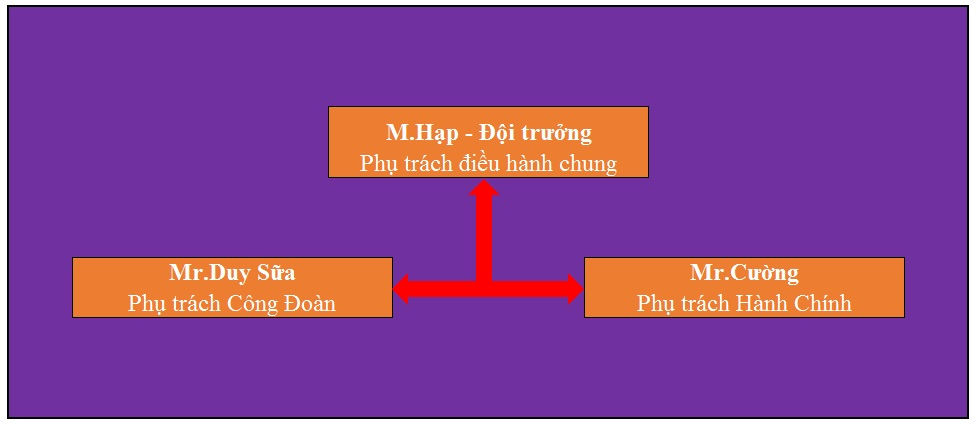

# Thông tin tổ chức và quy chế hoạt động

## Sơ đồ tổ chức
FC KĐT Đồng Văn không chỉ là một đội bóng.  
Chúng ta còn là một cộng đồng!  
Ban điều hành - thừa ủy quyền của toàn bộ anh em trong đội bóng sẽ đứng ra thực hiện những công việc chung.  
Sơ đồ tổ chức hiện nay được thể hiện như hình dưới đây:

## Chức năng - Nhiệm vụ
### Điều hành chung - Mr.Hạp
Mr.Hạp với tư cách đội trưởng đội bóng, đảm nhiệm các nhiệm vụ sau:
- Phụ trách tài chính: thu, chi quỹ đội bóng.
- Phụ trách tổ chức các trận đấu:
  * Đặt sân và thông báo lịch thi đấu.
  * Phục vụ đồ uống.
  * Trang phục: cấp trang phục thi đấu.
  * Trả chi phí sân bãi.
  * Lên lịch tổ chức giải.
- Các hoạt động điều hành chung khác.
### Công đoàn - Mr.Duy Sữa
Đội bóng FC KĐT Đồng Văn lập ra với mục đích tạo sân chơi cho anh em rèn luyện sức khỏe, giao lưu nâng cao tinh thần đoàn kết của các anh em cũng như gia đình.  
Đội bóng FC KĐT Đồng Văn đặc biệt hơn các đội bóng khác là chúng ta có Công Đoàn và hoạt động công đoàn rất mạnh.  
Do đó, vai trò của Mr.Duy Sữa là rất quan trọng và đảm nhiệm các nhiệm vụ dưới đây:
- Nắm bắt tốt thông tin để tổ chức thăm hỏi - hiếu - hỷ kịp thời.
- Thông báo và huy động, tổ chức anh em đi thăm hỏi - hiếu - hỷ.
- Đại diện chính cho anh em FC KĐT trong việc thăm hỏi - hiếu - hỷ.
::: warning Chú ý
Khi tổ chức thăm hỏi, có ít nhất 1 trong 3 người trong ban điều hành phải tham gia.
:::
### Hành Chính - Mr.Cường
Đội bóng FC KĐT Đồng Văn, với ý tưởng là một đội bóng được tổ chức tốt và kỷ luật.
Do đó, đội bóng cần đề ra những quy định cụ thể để để mọi thành viên nắm được và thực hiện.
Mr.Cường sẽ thực hiện các nhiệm vụ sau:
- Thay mặt anh em tổng kết và ban hành các quy định chung của đội bóng.
- Giám sát việc thực hiện các quy định.
- Phụ trách việc tổ chức giải.
- Phụ trách truyền thông của đội bóng. 

## Quy chế
### Công đoàn
::: danger Bắt buộc
- Thực hiện việc thăm hỏi trong các trường hợp sau:
  * Việc hiếu của tứ thân phụ mẫu, có mức chi `500,000 VNĐ`.
  * Thăm hỏi trong trường hợp trọng bệnh của anh em đội bóng, vợ hoặc con, mức chi `500,000 VNĐ`.
- Việc hỷ:
  * Đội bóng chỉ đi `quà chung 500,000 VNĐ` trong trường hợp được `mời`.
:::
::: warning Chú ý
- KHÔNG thăm ốm đau của tứ thân phụ mẫu.
- Kinh phí đi lại: trích quỹ đội bóng.
- Phương tiện đi lại: ưu tiên thuê xe ngoài.
- Trường hợp do khoảng cách đi thăm quá xa (không thể đi - về trong ngày) đội bóng chỉ gửi phong bì.
- Ngoài phong bì chung của đội bóng, anh em có thể tự do đi theo mức tình cảm cá nhân.
:::

### Đóng quỹ
::: danger Bắt buộc
- Việc đóng quỹ là `nghĩa vụ bắt buộc đối với mọi thành viên trong đội bóng`.
  * Quỹ bóng: mức đóng `200,000 VNĐ/người/tháng`.
  * Quỹ công đoàn: mức đóng `50,000 VNĐ/người/tháng` (áp dụng cho cả năm dù đá hay không) cho việc thăm hỏi, trung thu, du lịch.
  * Thời gian thu `từ ngày 1 tới 30 hàng tháng dương lịch`.
:::
::: warning Chú ý
- Riêng trường hợp `Mr.Trường và Mr.Hùng Honda` không cần nộp quỹ.  
Lý do: Mr.Trường và Mr.Hùng đã tạo điều kiện cho anh em được vào đá sân bóng Honda, góp phần giảm chi phí thuê sân bãi.
- Quỹ công đoàn đóng 100% các tháng dù đá hay không.
- Thành viên `không tham gia trong tháng đó cũng phải đóng tiền Quỹ bóng`.  
Trừ trường hợp `đã thông báo việc tạm dừng sinh hoạt trong tháng đó tới ban điều hành`.
:::

### Tuyển thành viên mới
- Số lượng thành viên hiện tại: 31 người.
  * Đội bóng sẽ giới hạn mức max là 35 người để đảm bảo chất lượng.
  * Việc tuyển thêm thành viên sẽ diễn ra vào một vài khoảng thời gian trong năm.  
  Thời gian cụ thể và số lượng cần tuyển sẽ do ban điều hành thông báo.
::: danger Bắt buộc
Cách thức tuyển thành viên:
- Ban điều hành thông báo khoảng thời gian tuyển người và số lượng người cần tuyển.
- Anh em trong đội bóng `giới thiệu các ứng viên`, với các tiêu chí sau:
  * Có hộ khẩu quanh khu đô thị Đồng Văn hoặc có ý định lập nghiệp lâu dài tại Đồng Văn.
  * Có ý thức tốt và mong muốn sinh họat lâu dài tại đội bóng.
  * Phù hợp với lối chơi của toàn đội.
- Thời gian thử thách: 2 tuần (tham gia ít nhất 80% số trận trong tháng).
- Kết nạp: bằng hình thức bỏ phiếu kín.  
Thành viên mới chỉ được kết nạp chính thức vào đội bóng khi `có sự đồng ý của ít nhất 80% số thành viên`.  
(Chỉ các phiếu của thành viên đã từng chơi bóng với ứng viên mới được tính là hợp lệ).
:::

### Chế độ nghỉ hưu
- Điều kiện: anh em chấn thương nặng không thể đá hoặc có tuổi không đảm bảo sức khỏe nhưng vẫn muốn sinh hoạt cùng đội bóng.
- Quyền lợi: hưởng mọi quyền lợi như anh em trong đội bóng (liên hoan, thăm hỏi, trung thu, du lịch, đá bóng - nếu cảm thấy đủ điều kiện).
- Nghĩa vụ: đóng quỹ công đoàn hàng tháng.

### Tạm nghỉ hoặc xin ra khỏi đội bóng
::: danger Bắt buộc
- Cần có lý do chính đáng.
- Báo trước thời gian nghỉ để đội bóng chủ động nhân sự.
- Cần có tương tác và thông báo tới toàn thể anh em đội bóng.
- Trường hợp xin nghỉ hẳn, cần hoàn thành nghĩa vụ tài chính đối với đội bóng.
:::

### Quy định khi cho người vào đá nhờ
::: danger Bắt buộc
Anh em thống nhất `không cho người quen` vào đá để tránh phát sinh các tiền lệ.
:::
::: warning Chú ý
Trường hợp bất khả kháng không đủ 2 đội (đặc biệt là sân Honda), ban điều hành có thể nhờ anh em gọi người đá hộ!
:::

### Đá giao hữu với đội ngoài
::: danger Bắt buộc
Trường hợp một số anh em lấy tư cách FC KĐT đi giao hữu với các đội bên ngoài cần phải thông qua ban điều hành (Ban điều hành sẽ tổng hợp ý kiến của đa số anh em và đưa ra quyết định).
:::

### Truyền thông
Đội bóng sử dụng nhóm Zalo là kênh truyền thông chính thống.
- Mọi thông tin, thông báo liên quan tới đội bóng sẽ được đưa lên nhóm Zalo.
- Một số anh em ít dùng Zalo, cần đăng ký với ban điều hành để nhận thông tin từ kênh liên lạc khác.
- Thông tin, hình ảnh đưa lên nhóm:
::: danger Bắt buộc
  * `Không hình ảnh/video đồi trụy.`
  * `Không quảng cáo.`
  * `Không sử dụng từ ngữ tục tĩu`.
:::
::: warning Chú ý
  * `Ưu tiên viết Tiếng Việt có dấu cho dễ đọc`.
:::

### Tổ chức giải
Giải đấu sẽ được tổ chức `2 lần/năm`.  
Thời gian và cách thức tổ chức giải sẽ được ban điều hành thông báo tới toàn thể anh em.

### Tài trợ
Đội bóng khuyến khích và trân trọng tấm lòng của các `Mạnh Thường Quân` tham gia tài trợ kinh phí cho đội bóng.

### Yêu cầu khi tham gia đá bóng
::: danger Bắt buộc
- Tuân thủ quy định của chủ sân, đặc biệt là sân Honda.
- Đi đúng giờ (tôn trọng tập thể và tôn trọng chính mình).  
Trừ trường hợp có việc bận, cần thông báo lên nhóm Zalo.
- Trường hợp anh em đánh nhau sẽ bị khai trừ ra khỏi đội bóng.
:::
::: warning Chú ý
- Trường hợp tới `muộn hoặc nghỉ` phải thông báo để ban điều hành chủ động bố trí nhân sự.
- Hạn chế cho mượn áo trong trường hợp quên áo tập để nâng cao tinh thành trách nhiệm, ý thức kỷ luật.
- Trường hợp có xô sát xảy ra, anh em cần đặt lợi ích chung đội bóng lên đầu tiên.  
Ban điều hành có trách nhiệm giúp đỡ anh em giải quyết các mâu thuẫn.
:::

::: tip Khuyến khích
- Tham gia ít nhất 50% số trận/tháng.
- Tham gia đá bóng đến hết giờ.
- Trang phục: mặc đầy đủ trang phục đá bóng (quần, áo, giầy, áo tập - đã cấp).
- Thái độ: nhiệt tình, vui vẻ, không nói tục chửi bậy, hạn chế các tình huống vào bóng nguy hiểm.
:::

### Luật chơi bóng
Đội bóng áp dụng các quy tắc cơ bản của luật bóng đá sân 7 người.
Có một số điểm khác đáng chú ý như dưới đây:
- Trường hợp đá sân nhỏ (như sân Đồng Văn):
  * Không tính penalty.
  * Nếu có 3 đội tham gia, thực hiện hình thức `thua ra, thắng ở lại` và `nếu đội thắng liên tiếp 2 trận sẽ nhường sân cho đội ở ngoài`.
- Trường hợp đá sân to (như sân Honda):
  * Thực hiện tính penalty.

